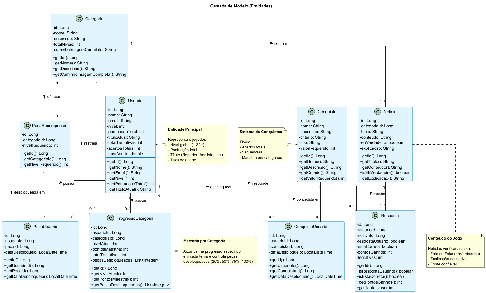
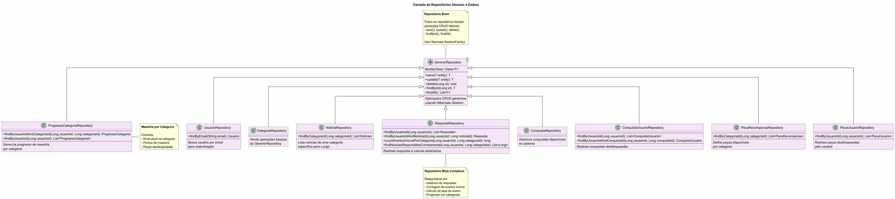
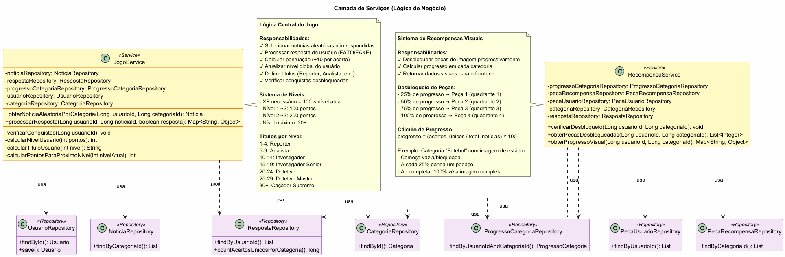
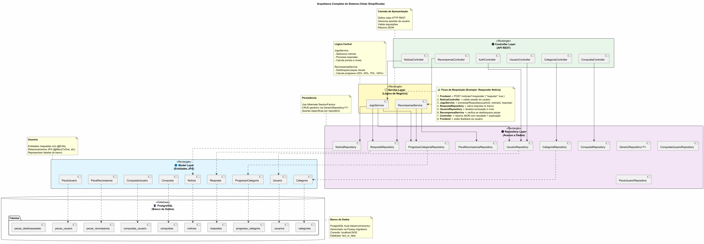

## Identificação

- **Nomes:** Otávio Krügel Zimmer e Renato Marquioro da Silva
- **Curso:** Sistemas de Informação

# Fact or Fake

## Ideia
Projeto educativo de gamificação para combate à desinformação, onde os usuários identificam se notícias, manchetes e citações são falsas ou verdadeiras. A ideia do projeto é ir além do entretenimento puro, desenvolvendo pensamento crítico e habilidades de checagem de fatos essenciais para a cidadania digital. O sistema funcionará com a exibição de notícias, onde o usuário decide se cada conteúdo é FATO ou FAKE, recebendo feedback educativo com explicações e fontes após cada resposta. O usuário ganhará pontos por acerto. Após certa quantidade de pontos, desbloqueia uma peça para formar uma imagem que representa a categoria de notícias. Com todas as peças, a imagem é completa.

O projeto foi implementado em Javalin, com um frontend em HTML, CSS e JavaScript.

## Processo de desenvolvimento
### Início
Primeiramente, foi necessário entender como funciona o framework Javalin. Já sabíamos que era um framework web, mas não sabíamos ao certo como implementar ele. Depois de estudar sobre ele, inicialmente criamos as classes de modelo principais. Depois, fizemos uma implementação mínima do projeto em arrays, onde testamos as rotas e requisições básicas que nós criamos. Depois, adicionamos mais rotas para compreender as categorias, progressos e conquistas.

### Banco de dados
Após implementar inicialmente em arrays, levamos o projeto para o banco de dados. Nossa ideia inicial era trabalhar com o SQLite, até por já termos um pouco de experiência com ele. Porém, vimos que não seria o ideal para lidar com várias requisições vindas de diversas fontes, então optamos por utilizar o PostgreSQL. Foi um pouco difícil a implementação inicial, pois tudo era meio "novo" pra nós. Tivemos que usar algumas anotações específicas nos modelos pra se adequar ao banco de dados, parte em que tivemos que pesquisar bastante para entender. Contamos com ajuda de IA para compreender o funcionamento e para a aplicação em exemplo mínimo, para depois, finalmente, implementarmos o banco de dados. Tivemos que criar um repositorie genérico e repositories para cada uma das classes de modelo, para lidar com o CRUD no banco de dados. Além disso, o projeto com banco de dados também exige um arquivo Hibernate, necessário para controlar o acesso ao banco de dados.

### Services
Pesquisamos como são arquitetados projetos em Java e vimos que utiliza-se services para lidar com a lógica de negócio. Então fizemos uma refatoração e separamos as definições da lógica, com a criação destes services para fazer as operações básicas.

### Criação de conta, login e logout
Implementamos também um sistema de contas os usuários, sendo necessário, por ora, informar apenas o nome e oemail para criar uma conta. Depois disso, pode-se fazer o login na conta e o logout.

### Figura (imagens)
Para a parte da figura da categoria (que é parte do processo de gamificação do projeto), implementamos uma lógica de divisão em 4 partes: 25%, 50%, 75% e 100%. Fizemos isso de forma dinâmica, ou seja, é identificada a quantidade de notícias de uma determinada categoria e é feita uma divisão destas notícias. A cada 25% de acertos que o usuário consegue sobre o total de notícias da categoria, desbloqueia-se uma peça para completar a figura. A implementação visual disto foi feita posteriormente no frontend, como explicado a seguir.

### Frontend
Para o frontend, criamos inicialmente um html bem básico, somente para testar as requisições com cliques. Depois, contamos com a ajuda de IA para "embelezar" as telas, com a adição do JS e do CSS. No frontend é implementado um menu, contendo a parte para "jogar", o perfil do usuário e as conquistas do usuário. Na parte de "Jogar", pode-se escolher uma categoria de notícias e ir respondendo as notícias que aparecem, completando as figuras e desbloqueando conquistas. No "Meu Perfil", o usuário pode ver o seu nível de conta, quantas notícias já respondeu, quantas acertou, a sua taxa de acertos e o progresso em cada categoria. Aí que entra a implementação da figura que representa a categoria: o backend envia a quantidade de peças desbloqueadas pelo usuário (que são obtidas conforme a porcentagem de conclusão da categoria) para o frontend, e este monta a figura com um sistema semelhante a "quadrantes". 25% (1 peça) desbloqueia o canto superior esquerdo, 50% (2 peças) o canto superior direito, 75% (3 peças) o canto inferior esquerdo e 100% (4 peças) o canto inferior direito, completando a imagem. Além disso, também pode-se consultar as conquistas do usuário na opção "Conquistas".

### Refatoração
Chegamos à conclusão que, em determinado momento, poderíamos fazer uma refatoração no projeto, pois alguns services estavam muito grandes, os repositories talvez não estivessem na forma ideal e o Main estava com muitas responsabilidades. Para isso, então, criamos novos services, arrumamos os repositories, criamos DTOs (o jeito antigo, com <Map, String> era muito confuso), criamos controllers para lidar com as rotas e um ``App.java``, responsável por configurar e inicializar a aplicação Javalin. Dessa forma, tudo ficou mais organizado e o Main com bem poucas atribuições.

### render.com
Adicionamos o projeto para o render.com, sendo necessário, para isso, mudar algumas coisas, como mudar o arquivo hibernate para permitir a execução no render.com (com variáveis de ambiente), em vez de salvar as variáveis no banco de dados (além de mudar o formato de algumas variáveis), adicionamos um dockerfile (necessário para rodar o web service), ajustamos os fetchs no frontend para permitir o render.com e não apenas o localhost (como vínhamos fazendo) e ajustamos o JDBC para se adaptar ao jeito que o render.com espera. Também contamos com ajuda de IA nesta parte, pois não entendíamos muito bem o que teríamos que alterar no projeto para sair do localhost e permitir a execução no render.com, com a IA nos guiando bastante nesse processo.

### itch.io
Para fazer o upload do projeto no itch.io, também tivemos que mudar algumas coisas, como corrigir o CORS para aceitar as requisições de diferentes domínios e não só o do render.com (esta parte foi bastante difícil, sendo necessário pesquisar como funciona o CORS e pedindo ajuda para a IA conforme o que iríamos implementar). Também implementamos um sistema de tokens para manter a sessão de um usuário, pois percebemos que depois de fazer o upload do projeto para o itch.io, no frontend, quando o usuário mudava de tela, "perdia-se" a sessão dele, de modo que não era possível fazer as requisições direito. Então vimos que os projetos assim lidam com os tokens, que foram implementados para permitir isso, tendo sido necessário mudar o controller de autenticação e o frontend, lidando com o ``localStorage``.

### Conclusão
Com isso, foi possível entregar uma boa versão inicial de nosso projeto, já com bastante funcionalidades para serem utilizadas. Esta versão foi publicada no itch.io, e pode ser acessada no seguinte link:
https://otaviozimmer.itch.io/fact-or-fake

---

### Modelo de Domínio

- **Usuario.java** — Representa um usuário do sistema com id, nome, email e nível.

- **Categoria.java** — Define categorias de notícias com nome, descrição, níveis totais, pontos para próximo nível e caminho da imagem completa.

- **Noticia.java** — Contém informações de uma notícia: título, conteúdo, se é verdadeira ou falsa, explicação e categoria associada.

- **Resposta.java** — Registra a resposta de um usuário para uma notícia, incluindo se está correta e pontos ganhos.

- **Conquista.java** — Define conquistas desbloqueáveis com nome, descrição, ícone, critério, tipo e valor requerido.

- **ConquistaUsuario.java** — Relaciona conquistas desbloqueadas por usuários com data de desbloqueio.

- **ProgressoCategoria.java** — Acompanha o progresso do usuário em cada categoria: nível atual, pontos de maestria e peças desbloqueadas.

- **PecaRecompensa.java** — Define as peças do quebra-cabeça de recompensa para cada categoria, incluindo categoria associada, nível requerido para desbloqueio, caminho da imagem e posição no quebra-cabeça (x, y).

- **PecaUsuario.java** — Relaciona as peças de recompensa desbloqueadas por cada usuário, registrando qual peça foi desbloqueada e a data de desbloqueio.

### Sistema de Gamificação

#### Pontuação
- **Acerto:** os pontos são calculados conforme o número de notícias da categoria.
- **Erro:** 0 pontos (pode tentar novamente)
- Apenas respostas corretas são salvas no banco
- Notícias erradas podem ser respondidas novamente

#### Conquistas
O sistema de conquistas é desbloqueado automaticamente quando o usuário atinge determinados marcos:

**Conquista Alpha - "Primeiros Passos":**
- **Critério:** Acumular 40 pontos totais
- **Tipo:** PONTOS_TOTAIS

O sistema é extensível para futuros tipos de conquistas também.

#### Progressão por Categoria
Cada categoria possui sistema independente de níveis:
- 5 níveis de progresso (0 a 4)
- Desbloqueio de peças do quebra-cabeça por nível
- Cada nível desbloqueia 25% da imagem completa
- Imagem final revelada ao atingir nível 4

## Configuração

- **HibernateConfig.java** — Classe de configuração do Hibernate que gerencia a SessionFactory, responsável por inicializar a conexão com o banco de dados PostgreSQL e fornecer sessões para operações de persistência.

## Banco de Dados

O projeto utiliza **PostgreSQL** como sistema de gerenciamento de banco de dados. A estrutura inclui:

**Tabelas principais:**
- `usuarios` — armazena dados dos usuários
- `categorias` — categorias de notícias
- `noticias` — conteúdo de notícias verificadas
- `respostas` — respostas dos usuários às notícias
- `conquistas` — conquistas disponíveis no sistema
- `conquistas_usuario` — conquistas desbloqueadas por usuários
- `progresso_categoria` — progresso dos usuários em cada categoria
- `pecas_recompensa` — peças do quebra-cabeça de cada categoria
- `pecas_usuario` — peças desbloqueadas pelos usuários

**Observação:** o sistema foi migrado de arrays em memória para persistência completa em banco de dados PostgreSQL, garantindo que todos os dados sejam salvos permanentemente. Todos os endpoints CRUD (Create, Read, Update, Delete) estão implementados para as principais entidades.

---

## 🐳 DevContainer

O projeto está configurado com um **DevContainer** para facilitar o desenvolvimento e avaliação sem necessidade de instalar dependências localmente.

### O que está incluído?
- ☕ Java 17 (OpenJDK)
- 📦 Maven
- 🐘 PostgreSQL
- 🔧 Ferramentas de desenvolvimento

### Como usar?

#### Opção 1: GitHub Codespaces (Recomendado)
1. Acesse o repositório no GitHub
2. Clique em **Code** > **Codespaces** > **Create codespace on main**
3. Aguarde o ambiente inicializar
4. Execute: `mvn exec:java`
5. Acesse: `http://localhost:3000`

#### Opção 2: VS Code Local
1. Instale a extensão **Dev Containers**
2. Abra o projeto
3. Pressione `F1` > **Dev Containers: Reopen in Container**
4. Execute: `mvn exec:java`

**Mais detalhes:** Veja `.devcontainer/README.md`

---

## 🚀 Como executar localmente (sem DevContainer)

### Pré-requisitos
- Java 17+
- Maven
- PostgreSQL

### Configuração do Banco de Dados
1. Crie o banco: `CREATE DATABASE fact_or_fake;`
2. Configure as credenciais em `hibernate.cfg.xml`
3. Insira as tabelas no banco de dados
4. Popule as tabelas no banco de dados

### Executar
```bash
mvn clean package
mvn exec:java
```

A API estará disponível em: `http://localhost:3000`

---

## 📊 Sistema de Pontuação e Níveis

### Pontos
- **Acerto:** pontos calculados conforme quantidade de notícias
- **Erro:** 0 pontos (não perde progresso)
- Apenas respostas corretas são salvas

### Níveis da Conta
A progressão é **global** (soma de todas as categorias):

```
XP necessário = 100 × nível atual
```

| Nível | XP Necessário | XP Total Acumulado | Título |
|-------|---------------|-------------------|---------|
| 1 | 0 | 0 | Reporter |
| 2-4 | 100-400 | 100-1000 | Reporter |
| 5-9 | 500-900 | 1500-4500 | Analista |
| 10-14 | 1000-1400 | 5500-10500 | Investigador |
| 15-19 | 1500-1900 | 12000-19000 | Investigador Sênior |
| 20-24 | 2000-2400 | 21000-30000 | Detetive |
| 25-29 | 2500-2900 | 32500-43500 | Detetive Master |
| 30+ | 3000+ | 46500+ | **Caçador Supremo** |

### Progresso por Categoria
Cada categoria possui progresso independente:

```
Progresso = (acertos_únicos / total_notícias_categoria) × 100
```

**Desbloqueio de Peças:**
- 25% de progresso → Peça 1
- 50% de progresso → Peça 2
- 75% de progresso → Peça 3
- 100% de progresso → Peça 4 (imagem completa!)

### Taxa de Acerto
Métrica de desempenho geral:

```
Taxa de Acerto = (total_acertos / total_tentativas) × 100
```

Não afeta pontos ou nível, apenas estatística.

---

## Diagramas

### Diagrama de Controladores


### Diagrama de Entidades


### Diagrama de Repositórios


### Diagrama de Serviços


### Diagrama Geral


## 🎮 Frontend

Interface web desenvolvida com HTML, CSS e JavaScript vanilla.

**Funcionalidades:**
- 🏠 Página inicial
- 🎯 Jogo (responder notícias)
- 👤 Perfil do usuário
  - Barra de progresso de nível
  - Progresso por categoria
  - Conquistas desbloqueadas
  - Recompensas visuais (peças)
- 📊 Estatísticas
- 🔐 Sistema de sessão (login simples por email)

**Acesso:** `http://localhost:3000` (depois de iniciar o backend)

---

## Fontes
- Javalin: https://javalin.io/documentation#getting-started

- POM: https://maven.apache.org/pom.html

- Maven: https://maven.apache.org/guides/getting-started/maven-in-five-minutes.html 

- PostgreSQL: https://jdbc.postgresql.org/documentation/setup/

- Anotações: https://www.oracle.com/technical-resources/articles/java/javadoc-tool.html;
https://jakarta.ee/specifications/persistence/3.1/jakarta-persistence-spec-3.1.html;
https://docs.oracle.com/javaee/7/api/javax/persistence/package-summary.html;
https://docs.hibernate.org/orm/6.4/javadocs/org/hibernate/annotations/Type.html

- Hibernate: https://hibernate.org/orm/documentation/7.1/;
https://docs.hibernate.org/orm/6.4/userguide/html_single/#annotations

- Repositories: https://www.dio.me/articles/o-que-e-o-repository-866d13a8e1e5

- Services: https://pt.stackoverflow.com/questions/381324/o-que-%C3%A9-um-service-e-qual-sua-diferen%C3%A7a-para-um-controller

- Controllers: https://pt.stackoverflow.com/questions/329167/como-utilizar-o-controller-em-uma-aplica%C3%A7%C3%A3o-java

- DTOs: https://medium.com/@jigorsilva/entendendo-dtos-em-java-um-guia-completo-para-iniciantes-55e82264918f;
https://docs.oracle.com/en/java/javase/17/language/records.html;
https://docs.oracle.com/en/java/javase/17/language/records.html

- Docker: https://javalin.io/tutorials/docker

- CORS: https://developer.mozilla.org/en-US/docs/Web/HTTP/CORS

- Tokens: https://jwt.io/introduction